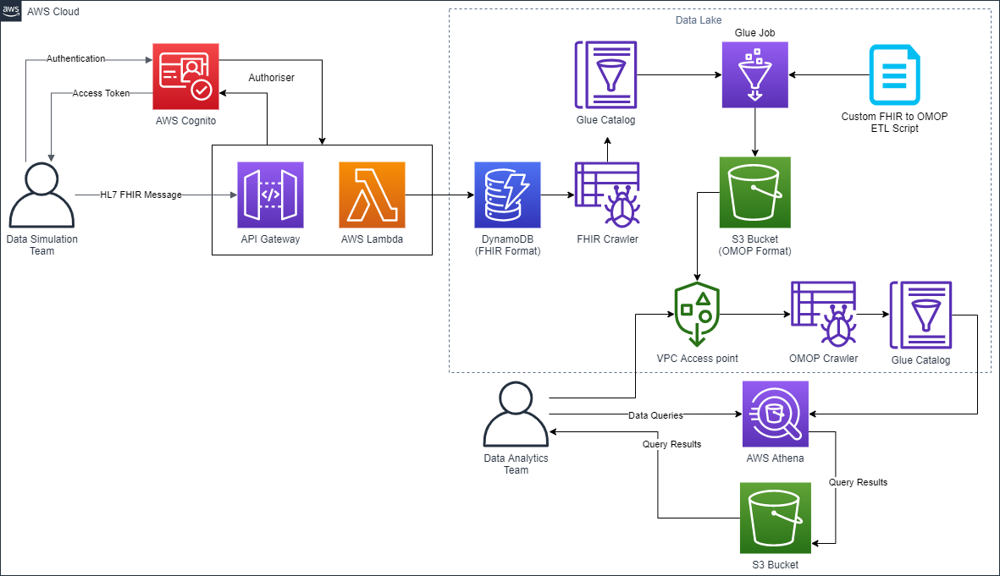
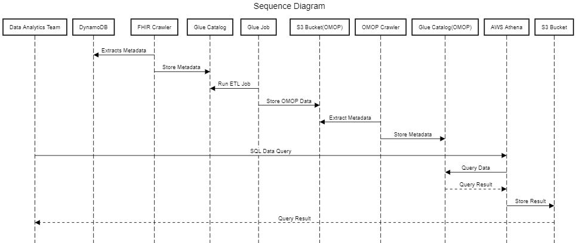
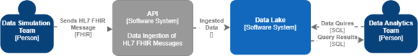
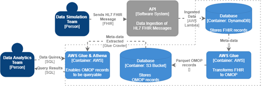
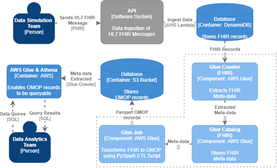
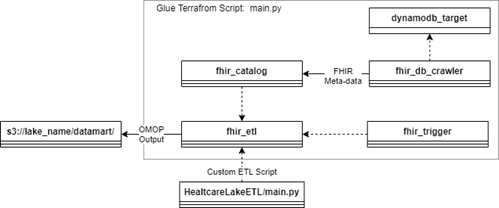

# Healthcare Data Lake - Portfolio B

## Overview

### Client
Our client is Dr. Philip D. Harfield, Health Data Scientist (Informatics) at NIHR Bristol Biomedical Research Centre, University of Bristol. He has Representative Project, HDR-UK South West Better Care Partnership.

### Domain
The Domain of our project is the Healthcare Analytics Environment team who will design, implement and test a set of candidate cloud-hosted analytics environment that provides sufficient functionality while also maintaining a source data environment. The overall domain of the 3 teams (Healthcare Data Lake Team, Healthcare Analysis Team and Healthcare Simulation Team) is NHS Healthier Together Sustainability Transformation Partnership Bristol, North Somerset, and South Gloucestershire (BNSSG) & Bristol Biomedical Research Centre, University of Bristol Medical School.

### Project
The project entails combining a wealth of data from data owners (GPs Patient data, ambulance services, 111, mental health services, etc.) into a data lake. The data in the data lake would be accessed and used by those such as data scientists in the field of medical care. This will be used to inform clinical decision making by providing more advanced insights into the longitudinal health of the patient on arrival and understand the merits of previous clinic decisions taken. The project is one of three designed an end-to-end proof of concept to the local NHS. We will be working alongside the "Healthcare Data Visualisation" and "Healthcare Analytics Environment" teams.

### Vision
The Healthcare Data Lake Project is evisioning a future integrated data storage solution, one that is scalable and portable, while using the latest cloud-based technologies. Starting with a prototype, the final scope is to create, alongside the Simulation and Analytics Projects, a system that is going to change how data is handled and used in the healthcare system. There is the real possibility that this three projects will represent the cornerstone of a future solution used and developed extensively by the NHS, which will bring immediate aid to the average medical worker and improve the quality of the service provided to the patients.

## Stakeholder and Requirements

### Primary Stakeholder

Philip Harfield is our client and primary stakeholder, and this software is being developed for him at Bristol, North Somerset and South Gloucestershire NHS CCG
(BNSSG). 

- The primary user story for this stakeholder is that BNSSG may require information about long-term data analytics from multiple sources. E.g how the long term health of patients has been affected by particular surgeries in childhood. This information could then be used to inform understanding of the merits of
previous clinical decisions taken.
- Additionally, another user story is it may require information in a more short term basis about the healthcare of the local population. E.g  to determine what percentage of people registered with a GP have been admitted to hospital in a given year. This information could then be used to inform strategic commissioning decisions on local healthcare services.
- Also BNSSG may want to use the software to curate datamarts from the data which can then be queried by external clients while maintaining security of the data lake. E.g A datamart could be curated of non-identifiable patient data of people who have had particular condition, so external research can be carried out on this condition without breaching data regulations. 

Now considering the user stories above, we can breakdown the story into a sequence of steps of user flow:

1. BNSSG wish to access the data, to do a query on how a particular surgery affects healthcare outcomes.
2. BNSSG use their secure access credentials to gain access to the lake.
3. BNSSG use a data analytics environment of their choice to query the lake based on records where the patient has had a particular surgery.
4. Clinical or strategical commissioning decisions can be taken based on the data.

Alternatively, the following user flow could take place for this stakeholder:

1. BNSSG wish to access the data, to do a query on how a particular surgery affects healthcare outcomes. 
2. BNSSG use their secure access credentials to gain access to the lake.
3. BNSSG queries an already created data mart containing only data which is a appropriate to its research. 
4. BNSSG analyses this data using an analytics environment of their choice.
5. Clinical or strategical commissioning decisions can be taken based on the data.

Exceptionally, the following user flow could take place:
 
1. BNSSG wish to access the data, to do a query on how a particular surgery affects healthcare outcomes.
2. BNSSG data analysts provide secure access credentials
3. The analysts receive a message that these user credentials are not valid. 
4. Access to the data is not granted.

### Additional Stakeholders

As well as our primary stakeholder as described above, we have additional interacting and non-interacting stakeholders. Some of these interacting stakeholders will be local healthcare organisations that will be supplying data to the data lake.

One of these local healthcare organisations, for example, could be the Bristol Student Health GP service.  This service offers GP healthcare to the majority of students at the University of Bristol and would have the following user stories when interacting with our software.

- A student may attend their GP with a health concern, which a GP can diagnose. A record of this can be sent to the data lake to be securely stored and used in analysis.
- A student may have a measurement taken when attending the GP, for example a height, weight or blood pressure measurement. This measurement can be then sent to the data lake to be stored with their record. A healthcare organisation could then monitor change over time or carry out other analytics.
- Finally a patient could contact the GP service to update their details, such as an address. This update of data can then be stored in the data lake to ensure that data is kept accurate and up to date.

Now considering the first user story above, we can break down the story into flow steps.

1. A patient attends the Student Health Service with a condition. 
2. A healthcare practitioner diagnoses this condition.
3. The Student Health Service wishes to send this data to the data lake.
3. The Student Health Service authenticates their identity and is provided with a secure access token.
4. The data is sent to the data lake securely via an API in the format of a FHIR message (industry standard for healthcare information)
5. The data is accepted by the API and an acceptance message is sent to the GP service.
6. The data is converted to a common data model format and securely stored.
7. The data can be queried and analysed as required.

We can also identify exceptional flow for this user story:

1. A patient attends the Student Health Service with a condition. 
2. A healthcare practitioner diagnoses this condition.
3. The Student Health Service wishes to send this data to the data lake.
4. The Student Health Service fails to authenticate their identity and is not provided with a secure access token.
5. Incoming data is not accepted to the data lake.
6. The health service receives an error message to provide valid credentials.

Additionally, we also have the following exceptional flow:

1. A patient attends the Student Health Service with a condition. 
2. A healthcare practitioner diagnoses this condition.
3. The Student Health Service wishes to send this data to the data lake.
4. The Student Health Service authenticates their identity and is provided with a secure access token.
5. Incoming data is not in an acceptable format matching the FHIR standard.
6. Data is not accepted into the data lake.
7. The healthcare service receives an error message to provide data in standard format.

In addition we have other interacting stakeholders such as the Bristol Royal Infirmary, Southmead Hospital, other GP practices and healthcare services in the Bristol, North Somerset and South Gloucestershire area. These healthcare services will have similar user stories to the the University of Bristol Student Health Service:

- A patient attends a healthcare service for a body imaging scan or measurement. This data can then be submitted to the data lake for secure storage and analysis. 
- A patient attends a healthcare service for an operation. This data can then be submitted to the data lake for secure storage and analysis. 
- A patient attends a private healthcare clinic. The record of the appointment and any actions can still be sent to the data lake for analysis.

In addition to these interacting stakeholders, we have some non-interacting stakeholders.
One of these is the general public, who expect high-quality public health care. They are stakeholders in this software due to its use in allowing data based decisions on what areas of healthcare need improvement and where additional services need to be commissioned. 
In addition a non-interacting stakeholder group are healthcare workers. Although they won't be interacting with the system directly, the software can be used to inform decisions which can be of great importance to them, such as number of GPs surgeries or district nurses required in a particular local area.  

### Requirements

Using these user stories above, we can decompose our flow steps into atomic implementation features (requirements) that we can use to assess the functionality of our software.

We have identified these core requirements for the functionality of our software:

1. An identity authentication process provides healthcare providers
    with credentials to supply data to an API. The identity authentication process must
    1. Ensure only that an access token is only provided to authorised users.
    
2. An API takes in data from local healthcare providers as a HL7
    FHIR message. We have chosen HL7 FHIR as it is the [UK standard for
    transferring
    healthcare messages.](https://digital.nhs.uk/services/fhir-uk-core) The API must:
    1. Ensure messages sent with an invalid access token are not accepted into the data lake and an appropriate error code is supplied.
    2. Ensure messages sent in a non-valid format are not accepted into the data lake and an appropriate error code is supplied.
    3. Ensure messages sent with a valid access token and in a valid FHIR format are accepted into the data lake, and an acceptance message is supplied. 

3. These data messages are transformed into a well structured common data model and stored in a cloud solution. We have chosen the OMOP common data model as it allows data to be standardised to allow for analytics from a range of sources. This must:
    1. Transform data from the received FHIR format to the OMOP common data model.
    2. Store data in a suitable format in OMOP form in the data lake.
    3. Ensure the data lake is regularly incrementally updated to include any new messages that have been received. 
4. The stored data is catalogued to allow for analysis. This must produce meta-data of the stored data.
5. A commercial ETL tool is used to curate data marts.
6. These data marts can be queried by the analytics environment.

We have also identified a set of additional requirements:

1.  Medical data is to be stored independently from pseudonymised
    patient identifiers.
2.  Provide a user console to monitor automated ETL jobs. 
3.  Provide full audit trails.

We can then use these requirements to test our developed software solution. 

## Personal Data, Privacy, Security and Ethics Management

### GDPR

The data lake solution developed by the “Healthcare Data Lake” project team is an integrating part of the larger prototype system, alongside ”Healthcare Data Simulation” and ”Healthcare Analytics” teams. The proposed system is going to be used in compliance with the NHS Digital GDPR compliance implementation and the liability for the personal data stored falls onto the respective primary stakeholder, Philip Harfield at Bristol, North Somerset and South Gloucestershire CCG (BNSSG).

The team developing the data lake infrastructure is responsible for creating a prototype secure, robust and scalable health data storage platform used for ingesting and interrogating patient’s data under the HL7 FHIR standard. User consent and data collection is not handled by the team as the datalake only ingests external data. As a client-specified requirement, medical data is going to be stored with pseudonymised patient identifiers, thus protecting the identity and integrity of the patients whose data is stored in the data lake. The patient data is transformed to population-level data model (OMOP CDM) for the purpose of large-scale analysis.  
The Data Lake team does not use the processed data. The responsability for the use of the processed data falls onto the end user (Data Analytics Team).

### Privacy

The Healthcare Lake project does not disclose, use, copy, publish or modify in any way the stored patient data. The patient records are ingested with the sole purpose of storage and curation. The process of transforming the data to the OMOP Common Data Model is internal, automated and independent. The data is solely and securely made available to the Data Analytics team which has to guarantee the further privacy of it.

### Security

Having to work with medical data, the security requirements for this prototype are high. The security of the Data Lake is guaranteed by the cloud provider's own security (in this case AWS). User policies and private S3 buckets ensure that the lake is not accessible by outsiders. The API can be only used with a token that is generated after logging into a user account created by the admin, so only authorized users/entities will be able to send data through the API.

There will be no outbound communication from inside the data lake and the only inbound connection is data ingestion from the client API. All curated data marts are accessible from the lake S3 bucket via VPC or ACL with the Data Analytics team who are responsible for the security of their environment in which they deploy their processes. All access to these will be logged and anomalies, violations and exceptions will be flagged for alerts and auditing using AWS Cloudwatch. Furthermore, this storage of curated data marts is in a private network separate from the rest of the data lake in any case. A comprehensive look at this architecture is included in the Architecture section this paper.

### Ethics

Ethics pre-approval was applied for on 19 November 2020, 12:00 GMT. The data handled in the project is simulated patients data supplied by the Healthcare Data Simulation project. The Healthcare Lake project does not collect any data from any real person nor handles any consent, as the scope of the project is to create a secure infrastructure for storing patients data.
In case of future development and testing with actual patients data, separate ethics approvals will be required, NHS REC review as it involves patients and governance approvals (e.g. Health Research Authority HRA). 

## Architecture

The approach we have entailed in designing our architecture is to base it on our clients’ requirements as well as other factors such as security, that will further improve the architecture of the system. When selecting between the different choices for components, as one of our clients is the NHS the cost of the system and the issue of vendor lock-in are major factors that we consider on selection.

### Infrastructure

The first requirement was to implement a cloud-hosted data lake leveraging big data technologies, making it scalable and secure. From this, we propose a modular, cloud platform-independent solution that should offer high scalability and performance at low-cost maintenance, development and deployment. The key to achieving this is to leverage the practices of Infrastructure-as-code(IaC), serverless architecture and to decide the most suitable cloud platform.

We choose Serverless as our cloud computing execution model as it means the cloud provider runs the server and dynamically manages the allocation of machine resources. The pricing will be based on the actual amount of resources consumed by the application. The benefits of this approach are huge reduction in infrastructure and development expenses which as mentioned is a deciding factor of the NHS client. Furthermore, it would allow our team to focus on shipping the microservices and have a secure, scalable infrastructure taken care of for them.

When deciding how to practically carry this out, we will use IaC. As IaC enables building infrastructure through extensible configuration files, this makes it easy to build and test, secure, updatable and allows rollback to previous versions. When selecting an IaC framework we chose Terraform, it supports all major cloud providers in addition to self-hosted options such as Kubernetes. This makes it a popular choice for a modern infrastructure team that seeks to avoid vendor lock-in and easily protect the security of it with robust tests and audits.

The most suitable choices for a cloud platform to host our data lake were Amazon Web Services (AWS), Microsoft Azure and Google Cloud Platform (GCP). Comparing these together the most cost-efficient long term is GPC which will benefit our client, Microsoft Azure is the most user-friendly this could increase production time in our team. However, we decided to use AWS as a member of our group already had previous expertise in AWS. Therefore, enabling us to have direction from the start and valuable advice for the other inexperienced team members, which will speed up the phase of learning the relevant technologies. Besides this AWS also provides the most support and services out of them as it is the oldest, making it well established. Most importantly it provides all the tools needed to carry out our project while being cost-effective for our client. However, as AWS can provide us with all the tools necessary we will be considering other option outside of AWS to make sure we have the best solution for our client.

### Data Ingestion and API

The next Requirement is our system must be able to receive a FHIR HL7 message from the Healthcare Simulator Team. For this to happen we will set up a RESTful API endpoint to ingest the data into the data lake. It will not offer the full CRUD as we only need to Create and Update. It should accept any structured or unstructured data when contained in a valid HL7 message.

We have chosen AWS API Gateway as it automatically handles many factors affecting the transfer of data between our team and the Simulation Team such as demanding an authorisation header in the message. There is also scope to add other data ingestion via an API Facade that accepts other kinds of data ingestion methods in the future so the client is not reliant on FHIR HL7. All of this while having flexible pricing, where its competitors do not. In the diagram below this is shown in the top left.

### Data Stores

Following the data being ingested, we will need an appropriate store for the FHIR records. DynamoDB is the most fitting option as we need to store small records of the same format in one table as DynamoDB will provide low latency operations in this situation compared to an S3 Bucket. It also enables its metadata to be extracted which is needed for data catalogues.

For the data lake storage option, we considered were AWS S3 Bucket, Wasabi and DigitalOcean. We choose S3 Bucket as it required no set-up cost and included a free tier for development this is beneficial when we are getting to grips with the technology. From the client’s perspective, it is instantly available to deal with demand as it can scale up and down, It is said to have a [99.99999% durability](https://aws.amazon.com/s3/reduced-redundancy/) which is a crucial factor when dealing with patients medical data. In our diagram we have used it when storing the transformed OMOP data, using an S3 bucket is suitable in this situation as can be restricted to secure access for the Data Analytics Team using S3 Access Point. It is also used to store query results from AWS Athena

### Common Data Model

Before moving onto cataloguing and transforming the data, we need to find a well-structured common data model (CDM) to transform the FHIR data into and then store. Ideally, this CDM needs to be easy to query and contains all the relevant information for the Data Analytics Team to use. We decided on the OMOP CDM. The reasons for this is we can then use the Observational Health Data Sciences and Informatics (OHDSI) resources that can perform data summaries and packages for cohort creation and various population-level data analytics, this will be very advantageous for the Data Analytics Team.

### Catalogue and ETL
To catalogue the FHIR records we receive from the Data Simulation Team we will need to extract its metadata and store it in the catalogue. We have chosen AWS Glue as it can cover all aspects using its Glue Crawler and Glue Catalogue services and provides an ETL tool. The Glue crawler operation is to crawl the DynamoDB table and extract its metadata. Glue crawlers can be scheduled giving the system a level of automation and can run on multiple data stores which is useful later on when crawling through the different OMOP tables.

When transforming the data from HL7 FHIR to OMOP we have used AWS Glue Job. The reason for this is it can create an automated ETL script as well as enabling custom script uploads in PySpark or Scala. Furthermore, it supports monitoring and live report issues of the ETL job using the AWS console or the Apache Spark Web UI which was another requirement from the client. 

### Logs

To audit our data lake environment the option we will use is AWS CloudWatch, as can support a range of AWS components and other applications. It will speed up our development as logs can be queried, sorted and group according to specific fields thus making it easier to find error logs.

### Security

Looking outside the requirements, for security, we will need to authorise access to the API. The most suitable solution is AWS Cognito if we are choosing AWS API Gateway as they are easy to integrate with one another. It also provides Multi-factor authentication, such as Time-based One-time Password for a possible option to further ensure security. AWS Cognito will provide the Data Simulation Team with a secure access token. The token can be time-scoped or resource-scoped. The Data simulation Team can then use this token to access the API Gateway and send their FHIR messages, this is shown on the left-hand side of the diagram below. 

To prevent unpredictable actions and unauthorised access to services and applications in our system. AWS has the feature of IAM roles, this allows the admin to assign specific permission to users, application or services. For example, the FHIR crawler will have permissions to extract the ingested data from the DynamoDB table and to write to the Glue catalogue. IAM Roles allow us to define user, application, or services behaviour. IAM Roles can be applied to groups of user, therefore introducing access levels to our system.

### Architecture Diagram

The Data Analytics Team will interact with our system through a VPC access point. The access point requires their account ID to allow them access to the S3 Bucket which contains the parquet OMOP data marts. Once they gained access, they can crawl, catalogue, and query the data. They can use Athena UI to send data queries to the Glue catalogue table using SQL statements. The results will then be stored in another S3 bucket. However, as they have access to the OMOP S3 Bucket they have the option of using different components to achieve the same outcome.

## Development Testing

Our testing strategy differed depending on whether we are testing infrastructure or application logic. As most of our code is a declarative language (HCL), it used end-to-end tests, integration tests and policy tests. However, our ETL module used an imperative language and thus had unit tests written to verify that the mapping functions resulted in their expected dataframes.  

For example, these unit tests were written for the PySpark (ETL) Job:

| Test        | Expect      |
| ----------- | ----------- |
| Patient: columns      | person_id, gender_concept_id, year_of_birth, month_of_birth, day_of_birth, birth_datetime       |
| Patient: birth_date  | Datetime is split into columns year_of_birth, month_of_birth, day_of_birth, birth_datetime        |
| Patient: gender | Gender is parsed correctly |
| Device Exposure: columns | device_exposure_id, person_id, device_exposure_start_date, device_type_concept_id |
| Measurement: columns |  measurement_id, person_id, measurement_concept_id, measurement_date, measurement_type_concept_id, measurement_datetime, value_as_number, provider_id, visit_occurrence_id, unit_source_value |
| Observation: columns | observation_id, person_id, observation_concept_id, observation_date, observation_type_concept_id, observation_datetime, value_as_string, provider_id, visit_occurrence_id |
| Procedure: columns | procedure_occurrence_id, person_id, procedure_concept_id, procedure_datetime, procedure_type_concept_id |
| Visit Occurence: columns | visit_occurrence_id, person_id, visit_concept_id, visit_start_datetime, visit_end_datetime, visit_type_concept_id, admitted_from_concept_id |

## Release Testing
Our deployment pipeline includes policy tests to check the Terraform plan before proceeding to apply the changes. For example, we use Open Policy Agent to test that a specific database isn't deleted by the plan. This can help catch disastrous security blunders as well, such as leaving an S3 bucket open to the public. We leveraged Terrascan - a tool that provides 500+ AWS security/compliance tests out-of-the-box and added this to our CI pipeline. 

To demonstrate our end-to-end testing, we chose the primary user story (API client / "The Data Simulation Team").
| Test | Expect |
| ---- | ------ |
| Apply plan | Successly deployed all resources in Terraform module (no AWS errors) |
| Unauthenticated `POST` request | `401` Unauthorized |
| Authenticated `POST` request | `200` Success |
| DynamoDB table entry | Body from authenticated request written to database |

## OO Design & UML

The reason we have created the UML diagrams below is to focus on the use case of the Data Analytics Team. This means focusing on the output we provide them alongside how they might interact with our system. Therefore, our dynamic sequence diagram will be aimed at the interaction side, and the C4 model (static) diagrams will focus on how to design the best output.

We have chosen to focus on these sections as we needed clarity on the approach of production of the data marts as the Data Analytics Team are reliant on them. Alongside this, there was confusion early on about which team was meant to curate the data marts, therefore, we needed to confirm how they would be interacting with the system and how to structure our AWS Glue terraform code. 

### Sequence Diagram (Dynamic Model)

We have chosen a sequence diagram as we feel it best represents the interactions between the components in our system and does so in a simple and self-explanatory way.

This model has confirmed how we will expect the Data Analytics Team to interact with our data lake, and what processes will take place to give them a response.

### C4 Model (Static Model)

We have followed the [C4 model](https://c4model.com/) as a static diagram as the other types of static diagram did not suit our project.  This is because we are using Infrastructure-as-code not Object Oriented therefore we are not dealing with classes and methods. Besides this, the C4 model provides an efficient and effective way to communicate the software design. It does this by following the top-down design approach by having four levels of detail (System Context, Container, Component, Code).

From this model, we gained insight into how we might structure our terraform code for our AWS Glue components and what we will need to be taking as parameters and outputs.

Level 1: System context diagram, shows an abstract view of the whole system.

Level 2: Container diagram, zooms into the data lake.

Level 3: Component diagram, zooms into AWS Glue revealing the main components we will be using in this section.

Level 4: Code diagram, shows a plan of what terraform resource we will be needing and how we will structure them.

## Acceptance Testing (Evaluation)

## Reflection

This project is an integrated part of a larger prototype, so its success depends on the success of every component. And this project has been indeed a success. The process was long ride, a marathon, which came along with a deal of challenges but has taught us more than any would have expected. 

### With great achievements comes great challenges

Starting work as a group where no one knows each other, with people that have different skills, is always a challenge in itself. With great requirements, the nature of this project imposed learning completely new concepts and skills from scratch, which was an initial bottleneck. But having one experienced team member that could lead the team and guide through all the new information was an extraordinary asset. From completing tutorials, reading blogs and pieces of documentation to having team-workshops, the software-development process was a steep-curve learning process, in which the team became not only more skilled and organised, but we all got to know each other better and became a united team. 

Another challenge we encountered was integration with two other teams. We solved this for one team at the very beginning by deploying a temporary API so their development process was not left waiting for us to implement our project. We were then able to make them transition to the real API without breaking changes. As for the other team, we proposed our solution architecture early on so that they understood how data would be accessed (through S3) on their end, before having the data to make available.

The hardship of doing everything online was experienced in this project as well. Keeping track of where everyone is in terms of learning and work was quite hard, especially in the first half of SPE. In time, we found that having frequent stand-up meetings was a great way of keeping up with everybody, between the working sessions. While in these we would split up in sub-teams or individually in order to tackle different tasks. We also utilised the features of GitHub for issue tracking, Kanban, automated jobs on pull requests etc. to increase organisation and produced documentation, usage instructions, solution architecture diagrams etc. for improved knowledge transfer.

### Discipline leads to success

Organised work, efficient communication and split workloads were essential processes. The main way in which we kept track of our tasks was using Kanban boards. Here each team member would be assigned tasks and provided instructions for it. When completed, each pull request would be subject to peer review after it passed the automatic tests.

The team has communicated with the client on a constant basis through email, and periodically video-meetings would be organised. When the client would request changes to our project, we would have a thorough discussion and together decide what we could implement.

Frequent meeting and stand-ups have provided a great way of keeping track and staying on the same page, while working together and sharing knowledge with each other. Peer help and review has been essential in creating an efficient and homogenous team.

### The future impact of the project

Our project lays in the middle of the bigger three-piece Healthcare data prototype. Needless to say, it is the core of the future system proposed by the NHS. While this project might remain at the prototype stage, it will serve as a working demonstration of what it can be achieved by using cloud-technology, with the potential of helping doctors and other medical staff to have better access and insight to medical data, regardless of its source, date or size.  

In terms of ethics, our project its responsible for keeping and safe-guarding externally ingested medical data for the purpose of future analysis. It might seem wrong to store huge loads of NHS patient data into the servers of a cloud provider, but this has already been proven very safe and it’s only getting safer in the future. We are transitioning into the era of cloud technology, and its full potential it’s yet to be uncovered.  

